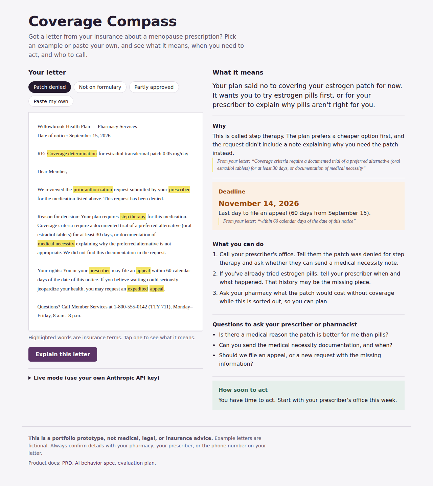

# Coverage Compass

**Turns a confusing insurance letter about a menopause prescription into plain language, a deadline, and a next step.**

[Try the live demo](https://pamelajijon.github.io/coverage-compass/) · [PRD](PRD.md) · [AI behavior spec](ai-behavior-spec.md) · [Evaluation plan](eval-plan.md)



---

## The problem

In digital pharmacy, I owned the communications patients receive when a prescription is approved, denied, or stuck in prior authorization. Those letters are accurate. They are also hard to act on. They're written to satisfy regulators, not to help someone figure out what to do on a Tuesday afternoon.

For women in menopause, this lands at a bad moment. Hormone therapy and newer non-hormonal treatments often hit step therapy, formulary, and quantity-limit rules. A denial letter arrives, the jargon is dense, the appeal deadline is buried, and the easiest path is to give up on a treatment that was working.

## What I built

A working prototype that:

- **Highlights insurance jargon** in the letter (step therapy, formulary exception, quantity limit) with a plain definition on tap. This part works with no AI at all.
- **Explains the decision** in plain language at a 6th–8th grade reading level.
- **Pulls out the deadline** and calculates the actual date.
- **Shows its evidence.** Every claim about the letter is backed by an exact quote from the letter, so the patient can check it.
- **Suggests next steps and questions** for the prescriber or pharmacist.
- **Escalates** when the situation is time-sensitive or unclear, and says "call today."

Three fictional example letters run in demo mode with no key. Live mode uses the Anthropic API with the user's own key to explain any letter.

## Key product decisions

**1. Grounded answers or none.** The model must quote the letter for every claim about the decision and the deadline. If the letter doesn't say something, the tool says "your letter doesn't say" instead of filling the gap. A confident wrong answer about an appeal deadline is worse than no tool.

**2. It never gives clinical advice.** It won't tell anyone to start, stop, or change a medication. Clinical questions get routed to the prescriber or pharmacist. The tool's job is to make that conversation faster and better, not replace it.

**3. Escalation is tuned to avoid false reassurance.** This comes from my biometrics background. In fingerprint and face matching, you trade off false accepts against false rejects, and you choose the threshold based on which error costs more. Here, telling someone "you have time" when they don't is the expensive error. So the escalation threshold is set conservatively, and I measure it directly. See the [evaluation plan](eval-plan.md).

**4. The glossary layer works without AI.** The highlighter is deterministic. If the model is down or the user has no key, they still get value. Not every problem needs an LLM, and the cheapest reliable piece should carry the most weight.

**5. Privacy by default.** No backend. No storage. The API key lives only in the browser tab. The paste box asks people to remove their name and member ID first.

## How I'd measure success

| Metric | Why it matters |
|---|---|
| False reassurance rate | Share of time-sensitive letters where the tool did not escalate. The safety metric. Target: zero on the test set. |
| Deadline accuracy | Correct date extracted and calculated. A wrong date is a harmful answer. |
| Grounding rate | Share of claims backed by an exact quote that actually appears in the letter. |
| Patient action rate | In a real pilot: share of patients who contact their prescriber or file an appeal within 7 days. |
| Treatment continuity | In a real pilot: fewer patients abandoning therapy after a denial. The outcome that matters. |

## Evaluation

This repo has a labeled test set and a Python script that runs it against the model and scores deadline accuracy, grounding, and escalation errors.

```bash
pip install anthropic
export ANTHROPIC_API_KEY=your-key
python run_evals.py
```

## Run it locally

No build step. Open `index.html` in a browser, or publish with GitHub Pages (Settings → Pages → Deploy from branch → `main`).

## What I'd do next

- Test with 5–8 women who've had a menopause prescription denied, and rewrite the copy based on where they get stuck.
- Partner with a pharmacy to measure whether patients act sooner.
- Add a "draft my appeal request" step that the prescriber's office can review.
- Spanish-language support.
- Expand the test set with real (de-identified) letters from multiple plans.

---

*This is a portfolio prototype, not medical, legal, or insurance advice. All example letters are fictional.*

Built by **Pamela Jijon**, AI Product Manager. [LinkedIn](https://www.linkedin.com/in/pamelajijonmba/)
